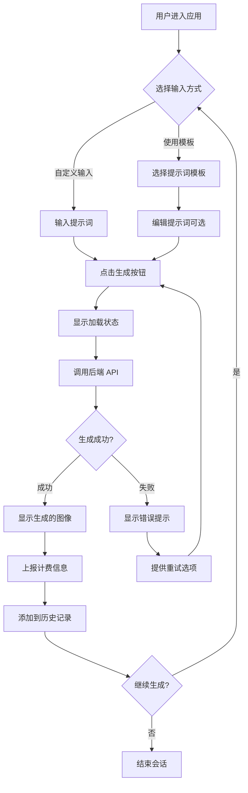
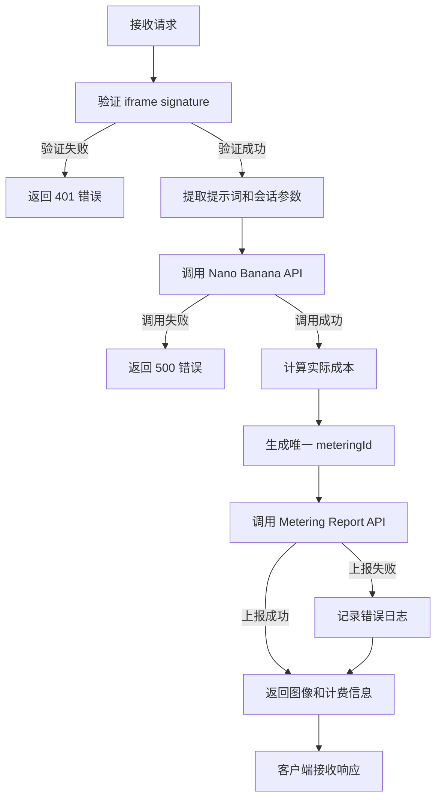
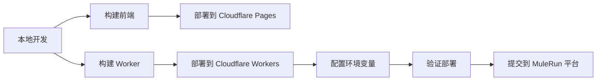

# AI 生图网页应用 - Nano Banana Image Generator

## 项目概述

### 应用定位
本项目是一个基于 MuleRun 平台的 AI 生图网页应用，用户可以通过输入文本提示词生成图像，应用内置了多个提示词模板方便用户快速使用。应用作为 iframe Agent 嵌入到 MuleRun 平台中，采用 Creator Metering 自定义计费模式。

### 核心价值
- 为用户提供简单易用的 AI 图像生成体验
- 通过提示词模板降低使用门槛
- 基于 Nano Banana 模型提供高质量的图像生成能力
- 实现透明可控的按使用量计费

### 技术架构
```
MuleRun 平台 (iframe 嵌入)
    ↓
前端网页应用 (React + TypeScript + Vite)
    ↓ (调用自己的 Worker API)
Cloudflare Worker (后端代理)
    ↓ (调用 MuleRun API)
MuleRun API 服务
    ├── Nano Banana 图像生成 (gemini-2.5-flash-image-preview)
    └── Metering API (计费上报)
```

## 功能需求

### 功能列表

| 功能模块 | 优先级 | 说明 |
|---------|--------|------|
| 提示词输入 | P0 | 用户输入图像生成的文本描述 |
| 提示词模板 | P0 | 提供预设模板供用户快速选择 |
| 图像生成 | P0 | 调用 Nano Banana 模型生成图像 |
| 生成历史 | P1 | 显示当前会话的生成历史 |
| 图像预览 | P0 | 放大查看生成的图像 |
| 计费上报 | P0 | 通过 Metering API 上报使用成本 |
| 加载状态 | P0 | 显示生成进度和等待状态 |
| 错误处理 | P0 | 友好的错误提示和重试机制 |

### 用户交互流程



## 界面设计

### 页面布局结构

```
┌─────────────────────────────────────────────┐
│  Header                                      │
│  ├── 应用标题: Nano Banana Image Generator   │
│  └── 会话信息: Session ID, 已消费 Credits     │
├─────────────────────────────────────────────┤
│  Main Content Area                           │
│  ┌───────────────────────────────────────┐   │
│  │ Prompt Input Section                  │   │
│  │ ├── Textarea (提示词输入框)             │   │
│  │ ├── Template Selector (模板选择器)      │   │
│  │ └── Generate Button (生成按钮)         │   │
│  └───────────────────────────────────────┘   │
│  ┌───────────────────────────────────────┐   │
│  │ Image Display Section                 │   │
│  │ ├── Generated Image (生成的图像)        │   │
│  │ ├── Loading Spinner (加载动画)         │   │
│  │ └── Error Message (错误提示)           │   │
│  └───────────────────────────────────────┘   │
│  ┌───────────────────────────────────────┐   │
│  │ History Section (可选折叠)              │   │
│  │ └── Image Grid (历史图像网格)           │   │
│  └───────────────────────────────────────┘   │
├─────────────────────────────────────────────┤
│  Footer                                      │
│  └── Powered by Nano Banana                 │
└─────────────────────────────────────────────┘
```

### 提示词模板设计

| 模板名称 | 提示词内容 | 适用场景 |
|---------|-----------|---------|
| 像素艺术 | A pixel-art style image of [subject], retro game aesthetic, vibrant colors | 复古游戏风格图像 |
| 赛博朋克 | A cyberpunk style [subject], neon lights, futuristic cityscape, night scene | 科幻未来风格 |
| 水彩画 | A watercolor painting of [subject], soft colors, artistic brushstrokes | 艺术绘画风格 |
| 3D 渲染 | A 3D rendered [subject], high quality, detailed textures, professional lighting | 三维立体效果 |
| 简笔画 | A minimalist line drawing of [subject], simple and clean, black and white | 极简风格插画 |
| 油画风格 | An oil painting of [subject], classic art style, rich colors and textures | 古典艺术风格 |

模板使用方式：
- 用户选择模板后，将 [subject] 替换为用户输入的主体内容
- 用户可以进一步编辑完整的提示词
- 提供"清空"和"重置为模板"的功能

### UI 组件规划

| 组件类型 | shadcn/ui 组件 | 用途 |
|---------|---------------|------|
| 输入区域 | Textarea | 提示词输入 |
| 按钮 | Button | 生成、清空、重试等操作 |
| 选择器 | Select | 模板选择下拉框 |
| 卡片 | Card | 包裹各个功能区域 |
| 提示信息 | Alert | 错误和警告提示 |
| 加载动画 | Skeleton | 图像生成加载状态 |
| 图像网格 | - | 自定义历史记录展示 |
| 对话框 | Dialog | 图像放大预览 |
| 徽章 | Badge | 显示计费信息 |

## 数据模型

### 前端状态管理

```typescript
// 应用主状态
interface AppState {
  prompt: string                    // 当前输入的提示词
  selectedTemplate: string | null   // 选中的模板 ID
  isGenerating: boolean            // 是否正在生成
  currentImage: GeneratedImage | null  // 当前生成的图像
  history: GeneratedImage[]        // 历史记录
  error: string | null             // 错误信息
  totalCreditsUsed: number         // 本次会话已消费的 Credits
}

// 生成的图像数据
interface GeneratedImage {
  id: string                       // 唯一标识
  prompt: string                   // 使用的提示词
  imageData: string                // Base64 编码的图像数据
  timestamp: number                // 生成时间戳
  creditsUsed: number              // 本次消费的 Credits
}

// 提示词模板
interface PromptTemplate {
  id: string                       // 模板唯一标识
  name: string                     // 模板名称
  prompt: string                   // 模板内容（含占位符）
  category: string                 // 分类标签
}
```

### 会话参数 (从 URL 提取)

```typescript
// MuleRun 平台传递的 iframe 参数
interface IframeParams {
  userId: string          // 用户 ID
  agentId: string         // Agent ID
  time: string            // 时间戳（字符串格式）
  nonce: string           // 随机数
  origin: string          // 来源
  sessionId: string       // 会话 ID
  signature: string       // HMAC-SHA256 签名
}
```

### API 请求格式

#### 图像生成请求

```typescript
// 请求体结构
interface GenerateImageRequest {
  prompt: string                   // 用户提示词
  userId: string                   // 从 iframe 参数提取
  agentId: string                  // 从 iframe 参数提取
  sessionId: string                // 从 iframe 参数提取
  time: string                     // 从 iframe 参数提取
  nonce: string                    // 从 iframe 参数提取
  origin: string                   // 从 iframe 参数提取
  signature: string                // 从 iframe 参数提取
}

// 响应体结构
interface GenerateImageResponse {
  success: boolean
  data?: {
    imageData: string              // Base64 编码的图像
    creditsUsed: number            // 本次消耗的 Credits
    meteringId: string             // 计费记录 ID
  }
  error?: string                   // 错误信息
  errorCode?: string               // 错误代码
}
```

#### 计费上报请求

```typescript
// Metering Report 请求
interface MeteringReportRequest {
  meteringId: string        // 唯一计费 ID（防重复）
  cost: number              // 消耗的 Credits (0.0001 的倍数)
  isFinal: boolean          // 是否为最终报告
}

// Metering Report 响应
interface MeteringReportResponse {
  success: boolean
  message?: string
}
```

## 后端接口设计

### Worker API 端点

| 端点路径 | 方法 | 说明 | 鉴权要求 |
|---------|-----|------|---------|
| /api/generate | POST | 生成图像并上报计费 | iframe signature |
| /api/health | GET | 健康检查 | 无 |
| /api/logs | GET | 获取日志（开发用） | 无 |

### /api/generate 处理流程



### Worker 业务逻辑

#### 签名验证逻辑

验证步骤：
1. 从请求体中提取 6 个签名参数（不包括 prompt 和 signature 本身）
2. 将 time 参数转换为字符串类型
3. 按字母顺序对参数进行排序
4. 序列化为无空格的 JSON 字符串
5. 使用 AGENT_KEY 计算 HMAC-SHA256 签名
6. 对比计算结果与接收到的签名

关键点：
- 只包含 userId, agentId, time, nonce, origin, sessionId 六个参数
- time 必须是字符串类型
- JSON 序列化必须移除所有空格
- 使用 Web Crypto API（Cloudflare Workers 环境）

#### 图像生成逻辑

调用参数：
- API 端点: `https://api.mulerun.com/v1/chat/completions`
- 模型: `gemini-2.5-flash-image-preview`
- 请求头: `Authorization: Bearer ${MULERUN_API_KEY}`
- 消息格式: 符合 OpenAI Chat Completions 规范

处理流程：
1. 构造 Chat Completions 请求（system prompt + user prompt）
2. 发送请求到 MuleRun API
3. 解析响应中的 Base64 图像数据
4. 提取 token 使用量信息

#### 计费计算逻辑

计费规则：
- Nano Banana 官方价格：3.9 cents/image (0.039 美元/张)
- Credits 换算：1 credit = 0.01 美元
- 单张图像成本：3.9 credits
- 创建者可设置倍数（通过 Creator Studio 配置）

计算公式：
```
实际消费 = 基础成本 × 创建者倍数
基础成本 = 3.9 credits
最终成本 = Math.round(实际消费 * 10000) / 10000  // 保留 4 位小数
```

示例：
- 倍数为 1.0: 每张图 3.9 credits
- 倍数为 2.0: 每张图 7.8 credits
- 倍数为 1.5: 每张图 5.85 credits

#### Metering 上报逻辑

上报参数：
- meteringId: 使用 `sessionId-timestamp-random` 格式生成唯一 ID
- cost: 计算得到的最终成本（0.0001 credits 的倍数）
- isFinal: 根据用户是否继续使用决定

幂等性保证：
- 使用唯一的 meteringId 防止重复计费
- 即使网络重试，相同 meteringId 不会重复扣费

错误处理：
- 计费上报失败不影响图像返回
- 记录详细错误日志用于排查
- 可选：实现重试机制

### 环境变量配置

| 变量名 | 说明 | 示例值 |
|-------|------|--------|
| AGENT_KEY | MuleRun Agent Key (用于签名验证) | ak-xxx |
| MULERUN_API_KEY | MuleRun API Key (用于调用服务) | sk-xxx |
| MULERUN_BASE_URL | MuleRun API 基础 URL | https://api.mulerun.com |
| APP_NAME | 应用名称 | nano-banana-generator |
| CREATOR_MULTIPLIER | 创建者计费倍数（可选） | 1.5 |

## 技术实现要点

### 前端实现

#### URL 参数提取

页面加载时需要从 URL 中提取 MuleRun 平台传递的参数：

```typescript
// 从 URL query string 提取参数
const extractIframeParams = (): IframeParams | null => {
  const params = new URLSearchParams(window.location.search)
  
  const requiredParams = [
    'userId', 'agentId', 'time', 
    'nonce', 'origin', 'sessionId', 'signature'
  ]
  
  // 检查所有必需参数是否存在
  const hasAllParams = requiredParams.every(key => params.has(key))
  
  if (!hasAllParams) {
    return null  // 缺少必需参数
  }
  
  return {
    userId: params.get('userId'),
    agentId: params.get('agentId'),
    time: params.get('time'),
    nonce: params.get('nonce'),
    origin: params.get('origin'),
    sessionId: params.get('sessionId'),
    signature: params.get('signature')
  }
}
```

#### API 调用实现

```typescript
// 调用后端生成图像
const generateImage = async (
  prompt: string, 
  iframeParams: IframeParams
): Promise<GenerateImageResponse> => {
  
  const response = await fetch('/api/generate', {
    method: 'POST',
    headers: {
      'Content-Type': 'application/json'
    },
    body: JSON.stringify({
      prompt,
      ...iframeParams  // 包含所有会话参数
    })
  })
  
  if (!response.ok) {
    throw new Error(`HTTP ${response.status}`)
  }
  
  return await response.json()
}
```

#### 状态管理策略

使用 React useState 管理组件状态：

```typescript
// 主要状态
const [prompt, setPrompt] = useState<string>('')
const [isGenerating, setIsGenerating] = useState<boolean>(false)
const [currentImage, setCurrentImage] = useState<GeneratedImage | null>(null)
const [history, setHistory] = useState<GeneratedImage[]>([])
const [error, setError] = useState<string | null>(null)
const [totalCredits, setTotalCredits] = useState<number>(0)

// 生成图像的处理函数
const handleGenerate = async () => {
  setIsGenerating(true)
  setError(null)
  
  try {
    const result = await generateImage(prompt, iframeParams)
    
    if (result.success && result.data) {
      const newImage: GeneratedImage = {
        id: Date.now().toString(),
        prompt,
        imageData: result.data.imageData,
        timestamp: Date.now(),
        creditsUsed: result.data.creditsUsed
      }
      
      setCurrentImage(newImage)
      setHistory(prev => [newImage, ...prev])
      setTotalCredits(prev => prev + result.data.creditsUsed)
    } else {
      setError(result.error || '生成失败')
    }
  } catch (err) {
    setError('网络错误，请重试')
  } finally {
    setIsGenerating(false)
  }
}
```

#### 模板选择实现

```typescript
// 预定义模板列表
const templates: PromptTemplate[] = [
  {
    id: 'pixel-art',
    name: '像素艺术',
    prompt: 'A pixel-art style image of {subject}, retro game aesthetic, vibrant colors',
    category: 'art'
  },
  // ... 其他模板
]

// 应用模板
const applyTemplate = (templateId: string, subject: string) => {
  const template = templates.find(t => t.id === templateId)
  if (template) {
    const filledPrompt = template.prompt.replace('{subject}', subject)
    setPrompt(filledPrompt)
  }
}
```

### 后端实现

#### Worker 入口结构

```typescript
// Worker 主入口
export default {
  async fetch(request: Request, env: Env): Promise<Response> {
    const url = new URL(request.url)
    
    // 处理 CORS
    if (request.method === 'OPTIONS') {
      return handleCORS()
    }
    
    // 路由分发
    if (url.pathname === '/api/generate' && request.method === 'POST') {
      return handleGenerate(request, env)
    }
    
    if (url.pathname === '/api/health' && request.method === 'GET') {
      return new Response(JSON.stringify({ status: 'ok' }), {
        headers: { 'Content-Type': 'application/json' }
      })
    }
    
    return new Response('Not Found', { status: 404 })
  }
}
```

#### 签名验证实现

```typescript
// 验证 iframe signature
async function verifySignature(
  requestBody: Record<string, any>,
  env: Env
): Promise<boolean> {
  
  const receivedSignature = requestBody.signature
  if (!receivedSignature) return false
  
  // 提取签名参数（6 个固定参数）
  const signatureParams = {
    userId: requestBody.userId,
    agentId: requestBody.agentId,
    time: String(requestBody.time),  // 转为字符串
    nonce: requestBody.nonce,
    origin: requestBody.origin,
    sessionId: requestBody.sessionId
  }
  
  // 按字母顺序排序
  const sortedKeys = Object.keys(signatureParams).sort()
  const sortedObj = sortedKeys.reduce((acc, key) => {
    acc[key] = signatureParams[key]
    return acc
  }, {} as Record<string, any>)
  
  // 序列化为无空格 JSON
  const payload = JSON.stringify(sortedObj)
    .replace(/: /g, ':')
    .replace(/, /g, ',')
  
  // 计算 HMAC-SHA256
  const encoder = new TextEncoder()
  const key = await crypto.subtle.importKey(
    'raw',
    encoder.encode(env.AGENT_KEY),
    { name: 'HMAC', hash: 'SHA-256' },
    false,
    ['sign']
  )
  
  const signature = await crypto.subtle.sign(
    'HMAC',
    key,
    encoder.encode(payload)
  )
  
  // 转为十六进制字符串
  const expectedSignature = Array.from(new Uint8Array(signature))
    .map(b => b.toString(16).padStart(2, '0'))
    .join('')
  
  return receivedSignature === expectedSignature
}
```

#### Nano Banana API 调用

```typescript
// 调用 Nano Banana 生成图像
async function callNanoBanana(
  prompt: string,
  env: Env
): Promise<{ imageData: string; tokensUsed: number }> {
  
  const response = await fetch(
    `${env.MULERUN_BASE_URL}/v1/chat/completions`,
    {
      method: 'POST',
      headers: {
        'Authorization': `Bearer ${env.MULERUN_API_KEY}`,
        'Content-Type': 'application/json'
      },
      body: JSON.stringify({
        model: 'gemini-2.5-flash-image-preview',
        messages: [
          {
            role: 'system',
            content: 'You are an AI image generator. Generate high-quality images based on user prompts.'
          },
          {
            role: 'user',
            content: prompt
          }
        ]
      })
    }
  )
  
  if (!response.ok) {
    throw new Error(`Nano Banana API error: ${response.status}`)
  }
  
  const data = await response.json()
  
  // 提取 Base64 图像数据
  const imageUrl = data.choices[0]?.delta?.content[0]?.image_url?.url
  if (!imageUrl) {
    throw new Error('No image data in response')
  }
  
  return {
    imageData: imageUrl,  // Base64 编码
    tokensUsed: data.usage?.total_tokens || 0
  }
}
```

#### Metering 上报实现

```typescript
// 生成唯一 meteringId
function generateMeteringId(sessionId: string): string {
  const timestamp = Date.now()
  const random = Math.random().toString(36).substring(2, 9)
  return `${sessionId}-${timestamp}-${random}`
}

// 上报计费信息
async function reportMetering(
  sessionId: string,
  cost: number,
  env: Env,
  isFinal: boolean = false
): Promise<void> {
  
  const meteringId = generateMeteringId(sessionId)
  
  const response = await fetch(
    `${env.MULERUN_BASE_URL}/sessions/metering`,
    {
      method: 'POST',
      headers: {
        'Authorization': `Bearer ${env.AGENT_KEY}`,
        'Content-Type': 'application/json'
      },
      body: JSON.stringify({
        meteringId,
        cost,
        isFinal
      })
    }
  )
  
  if (!response.ok) {
    console.error('Metering report failed:', response.status)
    // 不抛出错误，继续返回图像
  }
}
```

#### 完整的生成处理器

```typescript
async function handleGenerate(
  request: Request,
  env: Env
): Promise<Response> {
  
  try {
    const requestBody = await request.json()
    
    // 1. 验证签名
    const isValid = await verifySignature(requestBody, env)
    if (!isValid) {
      return jsonResponse({
        success: false,
        error: '签名验证失败',
        errorCode: 'SIGNATURE_INVALID'
      }, 401)
    }
    
    // 2. 提取参数
    const { prompt, sessionId } = requestBody
    
    if (!prompt || !sessionId) {
      return jsonResponse({
        success: false,
        error: '缺少必需参数',
        errorCode: 'MISSING_PARAMS'
      }, 400)
    }
    
    // 3. 调用 Nano Banana
    const { imageData, tokensUsed } = await callNanoBanana(prompt, env)
    
    // 4. 计算成本
    const baseCost = 3.9  // Nano Banana 基础成本
    const multiplier = parseFloat(env.CREATOR_MULTIPLIER || '1.0')
    const finalCost = Math.round(baseCost * multiplier * 10000) / 10000
    
    // 5. 上报计费
    await reportMetering(sessionId, finalCost, env, false)
    
    // 6. 返回结果
    return jsonResponse({
      success: true,
      data: {
        imageData,
        creditsUsed: finalCost,
        meteringId: generateMeteringId(sessionId)
      }
    })
    
  } catch (error) {
    console.error('Generate error:', error)
    return jsonResponse({
      success: false,
      error: '生成失败',
      errorCode: 'GENERATION_ERROR'
    }, 500)
  }
}

// 辅助函数：返回 JSON 响应
function jsonResponse(data: any, status: number = 200): Response {
  return new Response(JSON.stringify(data), {
    status,
    headers: {
      'Content-Type': 'application/json',
      'Access-Control-Allow-Origin': '*'
    }
  })
}
```

## 错误处理策略

### 错误分类

| 错误类型 | HTTP 状态码 | 错误代码 | 处理方式 |
|---------|-----------|---------|---------|
| 签名验证失败 | 401 | SIGNATURE_INVALID | 提示用户刷新页面 |
| 缺少必需参数 | 400 | MISSING_PARAMS | 显示参数错误提示 |
| 提示词为空 | 400 | EMPTY_PROMPT | 提示用户输入内容 |
| API 调用失败 | 500 | API_ERROR | 提供重试按钮 |
| 网络超时 | 504 | TIMEOUT | 提示网络问题并重试 |
| 计费上报失败 | - | METERING_FAILED | 记录日志，不影响用户 |

### 前端错误处理

错误提示设计：
- 使用 shadcn/ui Alert 组件显示错误
- 区分可重试错误和致命错误
- 提供明确的用户操作指引
- 记录错误到浏览器控制台

重试机制：
- 网络错误自动重试 1 次
- 用户可手动点击重试按钮
- 重试间隔：2 秒
- 最大重试次数：3 次

### 后端错误处理

日志记录：
- 记录所有 API 调用的请求和响应
- 记录签名验证失败的详细信息
- 记录计费上报的成功和失败
- 包含时间戳、会话 ID、错误堆栈

降级策略：
- 计费上报失败不影响图像返回
- API 调用失败返回友好错误信息
- 超时设置：Nano Banana API 30 秒超时

## 性能优化

### 前端优化

| 优化项 | 策略 |
|-------|------|
| 图像加载 | 使用 Base64 直接显示，避免额外请求 |
| 历史记录 | 限制最多显示 10 条历史记录 |
| 防抖处理 | 生成按钮防止重复点击 |
| 懒加载 | 历史记录区域按需加载 |
| 响应式图片 | 根据屏幕尺寸调整图像显示大小 |

### 后端优化

| 优化项 | 策略 |
|-------|------|
| 超时控制 | API 调用设置 30 秒超时 |
| 错误缓存 | 避免重复调用失败的 API |
| 日志批量 | 批量写入日志减少 I/O |
| CORS 缓存 | OPTIONS 请求结果缓存 |

## 部署和运维

### 部署流程



### 部署清单

#### 前端部署
- [ ] 执行 `npm run build` 构建前端
- [ ] 部署 dist 目录到 Cloudflare Pages
- [ ] 配置自定义域名（可选）
- [ ] 验证页面可正常访问

#### Worker 部署
- [ ] 执行 `npx wrangler deploy` 部署 Worker
- [ ] 配置所有必需的环境变量（secrets）
- [ ] 验证 API 端点可正常访问
- [ ] 测试签名验证功能

#### 环境变量配置
- [ ] AGENT_KEY: 从 MuleRun Creator Studio 获取
- [ ] MULERUN_API_KEY: 从 MuleRun Creator Studio 创建
- [ ] MULERUN_BASE_URL: https://api.mulerun.com
- [ ] APP_NAME: 应用名称
- [ ] CREATOR_MULTIPLIER: 计费倍数（可选，默认 1.0）

#### MuleRun 平台配置
- [ ] 在 Creator Studio 创建新的 iframe Agent
- [ ] 填写前端页面 URL（Cloudflare Pages 地址）
- [ ] 配置 Agent 名称和 Logo
- [ ] 编写 Agent 描述和使用说明
- [ ] 选择计费模式：Creator Metering
- [ ] 提交审核

### 监控和日志

#### 日志策略

前端日志：
- 浏览器控制台记录关键操作
- 记录 API 调用的请求和响应
- 记录错误堆栈和用户操作序列

Worker 日志：
- 使用 `console.log` 记录结构化日志
- 包含会话 ID、时间戳、操作类型
- 通过 `npx wrangler tail` 实时查看
- 在 Cloudflare Dashboard 查看历史日志

#### 健康检查

监控指标：
- API 响应时间
- 错误率（按错误类型统计）
- 计费上报成功率
- 图像生成成功率

检查方式：
- 定期访问 /api/health 端点
- 监控 Cloudflare Workers 的 Dashboard
- 设置告警规则（错误率 > 5%）

### 故障排查

常见问题诊断：

| 问题 | 可能原因 | 排查步骤 |
|------|---------|---------|
| 签名验证失败 | AGENT_KEY 配置错误 | 检查环境变量，验证 Key 有效性 |
| 图像生成失败 | API Key 无效或余额不足 | 检查 API Key，查看 Credits 余额 |
| 计费上报失败 | Metering API 不可用 | 查看 Worker 日志，检查 API 状态 |
| 页面无法加载 | CORS 配置错误 | 检查 Worker CORS 响应头 |
| 加载缓慢 | 网络问题或 API 超时 | 检查网络延迟，调整超时设置 |

## 安全性考虑

### 数据安全

| 安全项 | 措施 |
|-------|------|
| API Key 保护 | 只存储在 Worker 环境变量，不暴露到前端 |
| 签名验证 | 所有请求必须通过 iframe signature 验证 |
| 输入过滤 | 限制提示词长度，过滤特殊字符 |
| HTTPS 强制 | 全站使用 HTTPS 加密传输 |
| CORS 限制 | 只允许特定来源的跨域请求 |

### 输入验证

前端验证：
- 提示词长度限制：最少 5 个字符，最多 500 个字符
- 禁止空白提示词
- 过滤 HTML 标签和脚本代码

后端验证：
- 再次验证提示词长度
- 检查会话参数完整性
- 验证签名有效性
- 限制请求频率（可选）

## 测试策略

### 功能测试

| 测试场景 | 预期结果 |
|---------|---------|
| 输入提示词生成图像 | 成功生成图像并显示 |
| 使用模板生成图像 | 模板应用正确，生成成功 |
| 空提示词提交 | 显示错误提示，不调用 API |
| 网络错误 | 显示友好错误信息，提供重试 |
| 签名验证失败 | 返回 401 错误，提示用户刷新 |
| 计费上报 | 成功上报到 Metering API |
| 历史记录显示 | 正确显示生成历史和消费 |

### 集成测试

测试流程：
1. 在 MuleRun 平台中启动 Agent
2. 验证 iframe 参数正确传递
3. 测试图像生成完整流程
4. 验证计费信息正确上报
5. 检查会话状态和历史记录

### 性能测试

测试指标：
- 图像生成平均响应时间：< 10 秒
- API 调用成功率：> 99%
- 计费上报成功率：> 99%
- 页面首次加载时间：< 2 秒

## 未来扩展

### 功能扩展规划

| 功能 | 优先级 | 说明 |
|------|--------|------|
| 图像编辑 | P1 | 支持对生成的图像进行二次编辑 |
| 风格转换 | P1 | 提供多种艺术风格选择 |
| 批量生成 | P2 | 一次生成多张图像 |
| 图像下载 | P1 | 支持下载高清图像 |
| 分享功能 | P2 | 分享生成的图像到社交平台 |
| 收藏夹 | P2 | 用户可收藏喜欢的图像 |
| 高级参数 | P2 | 调整分辨率、长宽比等参数 |

### 技术优化方向

- 实现图像缓存机制减少重复生成
- 支持流式返回提升用户体验
- 集成更多 AI 图像模型（如 Midjourney、DALL-E）
- 实现用户偏好记忆功能
- 添加图像质量评分系统

## 设计总结

本设计文档定义了一个完整的 AI 生图网页应用，核心特性包括：

### 核心能力
- 基于 Nano Banana 模型的高质量图像生成
- 内置提示词模板降低使用门槛
- 完整的 MuleRun 平台集成（iframe + Metering）
- 透明可控的按使用量计费

### 技术架构
- 前端：React + TypeScript + Vite + shadcn/ui
- 后端：Cloudflare Workers
- 部署：Cloudflare Pages + Workers
- 集成：MuleRun Platform (iframe Agent)

### 关键设计点
- 严格的 iframe signature 验证确保安全性
- 幂等的 Metering API 上报避免重复计费
- 完善的错误处理和用户反馈机制
- 结构化的日志和监控体系

### 实施路径
1. 初始化项目结构（参考 PROJECT_INITIALIZATION_GUIDE.md）
2. 实现前端界面和核心交互
3. 开发 Worker API 和鉴权逻辑
4. 集成 Nano Banana 和 Metering API
5. 本地测试和调试
6. 部署到 Cloudflare（参考 DEVOPS_GUIDE.md）
7. 提交到 MuleRun 平台审核

该设计保持了合理的复杂度，专注于核心功能的实现，为后续扩展预留了空间。
